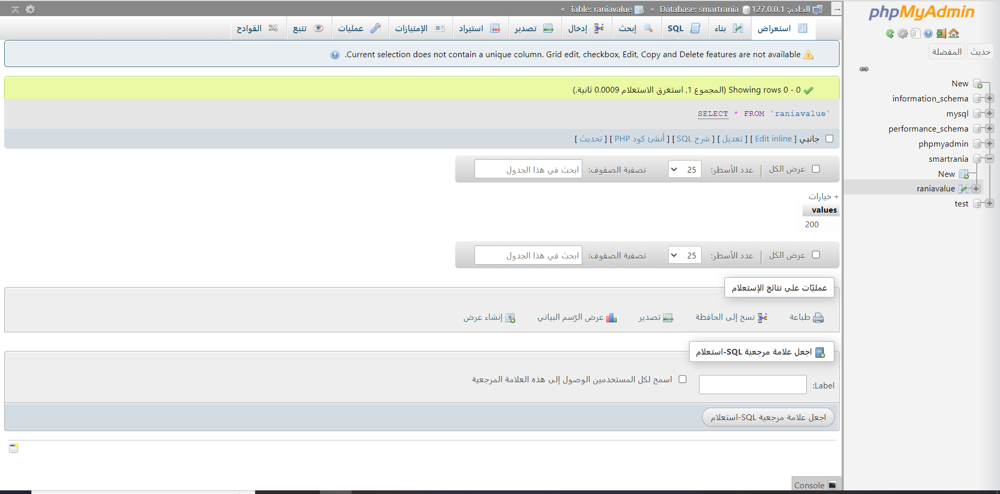
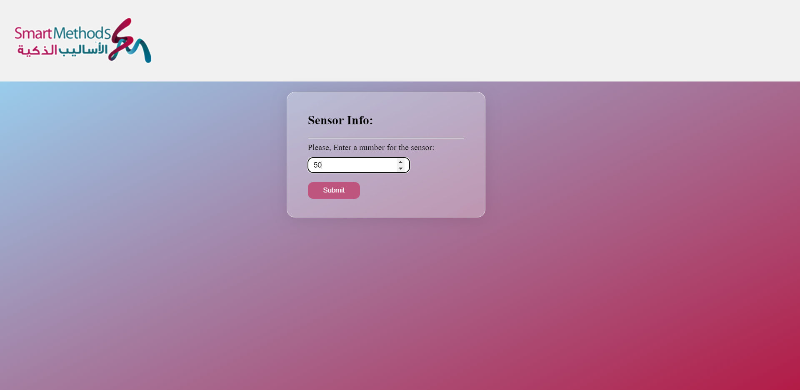
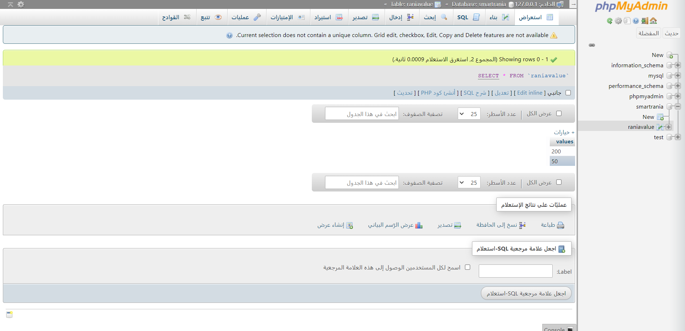

# IOT Task 🗣:

## Description 📄: 
A web page that uses the GET method to send and store values to the database.

## tools 🛠:
○ HTML  
○ CSS  
○ JavaScript  
○ PHP  
○ MYSQL  

## Steps :stars: :
○ First:The database before adding the new value  

 
○ Second:Enter an integer in the form  

 
○ Third:After submiting the form  

 
○ Fourth: The database after adding the new value  

